<div align="center">
<p align="center">
  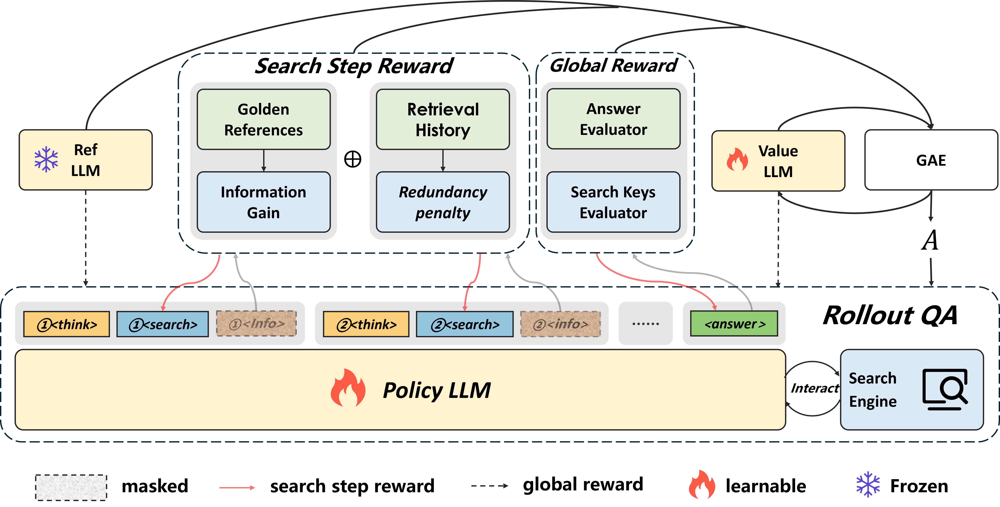
</p>
</div>

<div align="center">
<h1>StepSearch: Igniting LLMs Search Ability via Step-Wise Proximal Policy Optimization
</h1>
</div>
<div align="center">
  <a href='https://github.com/Zillwang/StepSearch'></a>
  <a href='https://arxiv.org/abs/2505.15107'></a>
  <a href='https://huggingface.co/Zill1'></a>
</div>

<p align="center">
  <i><b>Xuhui Zheng, Kang An, Ziliang Wang</b></i><br>
  <i><b>Yuhang Wang, Yichao Wu</b></i><br>
  <i>Sense Time , Nanjing University, Shenzhen University</i>
</p>

# 📌Introduction
StepSearch is a method specifically tailored for multi-hop question answering in search-based scenarios. It models the reasoning process as a sequence of tool invocations and information retrieval steps, where each step aims to gather relevant evidence toward answering a complex question. The system is trained using reinforcement learning, particularly the Proximal Policy Optimization (PPO) algorithm with token-level and rewards, to optimize a policy that decides search tools to invoke and what queries to issue at each stage.

- **Universal multi-hop search data.** We develop a novel MuSiQue-based pipeline, contributing 60k filtered sub-question search keywords that generalize across retrieval datasets.
- **StepSearch: Step-wise RL with dual rewards.** We augment PPO with token-level rewards—information gain and redundancy penalties—for both query formulation and document retrieval.
- **State-of-the-art performance.** StepSearch outperforms standard RL baselines by *5.7%*, *9.1%*, *10.0%*, and *15.2%* absolutely on diverse multi-hop Q&A benchmarks.

# 🔥News
- **[2025.09.10]** Released code and model weights.
- **[2025.08.21]** Accepted by EMNLP Main 2025.
- **[2025.05.20]** Released the initial paper.

# 🔗Links

- [Installation](#installation)
- [How to Start](#how-to-start)
- [Build your own dataset](#build-dataset)

- [Ackowledge](#acknowledge)
- [Citations](#citations)
<!-- - [Inference](#inference)
- [Use your own dataset](#use-your-own-dataset)
- [Use your own search engine](#use-your-own-search-engine) -->

# 🛠Installation
## StepSearch Environment (fork from [Search-R1](https://github.com/PeterGriffinJin/Search-R1))
<pre>conda create -n stepsearch python=3.10
conda activate stepsearch

# install torch [or you can skip this step and let vllm to install the correct version for you]
pip install torch==2.4.0 --index-url https://download.pytorch.org/whl/cu121
# install vllm
pip3 install vllm==0.5.4

# verl
pip install -e .

# flash attention 2
pip3 install flash-attn --no-build-isolation
</pre>

## Retriever Environment
<pre>conda create -n retriever python=3.10
conda activate retriever

# we recommend installing torch with conda for faiss-gpu
conda install pytorch==2.4.0 torchvision==0.19.0 torchaudio==2.4.0 pytorch-cuda=12.1 -c pytorch -c nvidia
pip install transformers datasets pyserini

## install the gpu version faiss to guarantee efficient RL rollout
conda install -c pytorch -c nvidia faiss-gpu=1.8.0

## API function
pip install uvicorn fastapi </pre>

# 🚗How to Start
Train a reasoning + search LLM on MusiQue dataset with e5 as the retriever while using MusiQue documents (training) and wikipedia (testing) as the corpus.

(1) Download datasets and indexing, corpus for retreiver
<pre>save_path=/the/data_root/to/save
python scripts/download.py --save_path $save_path
cat $save_path/part_* > $save_path/e5_Flat.index
gzip -d $save_path/wiki-18.jsonl.gz
</pre>

(2) Process the dataset for training
<pre>python scripts/data_process/musi_search.py --local_dir /the/data_root/to/save 
python scripts/data_process/musi_search.py --local_dir /the/data_root/to/save --test
</pre>

(3) Start the retrieval server.

The local retriever could be started by:
<pre>conda activate retriever
apt install redis-server -y
service redis-server start

bash launch_retrieval.sh
</pre>

If you need to use online search API (serper), you could do like this:
<pre>python search_r1/search/serper.py --api_key YOUR_API_KEY</pre>

(4) Start the StepSearch training on StePPO.
<pre>conda activate stepsearch
bash train.sh
</pre>

# 💾Build Dataset
## QA dataset with Step-Wise Information
For each piece of data, it is assembled in the following dictionary format. The reference information (List of String) for evaluating the step reward needs to be placed under the xxx field.
<pre>solution = {
    "target": [answer_1, answer_2, ...],
    "search_keys": [search_key_1, search_key2, ...]
}

data = {
    "data_source": data_source,
    "prompt": [{
        "role": "user",
        "content": question,
    }],
    "ability": "fact-reasoning",
    "reward_model": {
        "style": "rule",
        "ground_truth": solution,
    },
    "extra_info": {
        'split': split,
        'index': idx,
        "support_docs": [support_doc_1, support_doc_1, ...]
        # Note that support_docs must strictly correspond to those in the corpus
    }
} </pre>

## Corpus 
Following [Search-R1](#https://github.com/PeterGriffinJin/Search-R1), it's recommended to make your corpus a jsonl file, where each line (a dictionary with "id" key and "contents" key, or "title", "content" keys in replace) corresponds to one passage.

The "id" key corresponds to the passage id, while the "contents" key corresponds to the passage content ('"' + title + '"\n' + text), or directly match "title" and "content" keys Correspondingly. For example:
<pre>{
    "id": "0", 
    "contents": "Heartbeat Song (Kelly Clarkson song)\n'Heartbeat Song' is a song by American singer Kelly Clarkson from her seventh studio album, "Piece by Piece" (2015). Written by Mitch Allan, Audra Mae, Kara DioGuardi, and Jason Evigan."
}
...
{
    "id": "100", 
    "title": "Heartbeat (Don Johnson song)"
    "content": "'Heartbeat' is a 1986 song by Don Johnson. It was released as a single and included on the album of the same name. It became an international hit, peaking at number five on the "Billboard" Hot 100, and charting highly in many European countries."
}
...
</pre>

### Index the corpora. 
If you would like to use a local retriever as the search engine, you can index your own corpus by:
<pre>bash search_r1/search/build_index.sh</pre>

# 💡Performance

###  Main Results

<div align="center">
    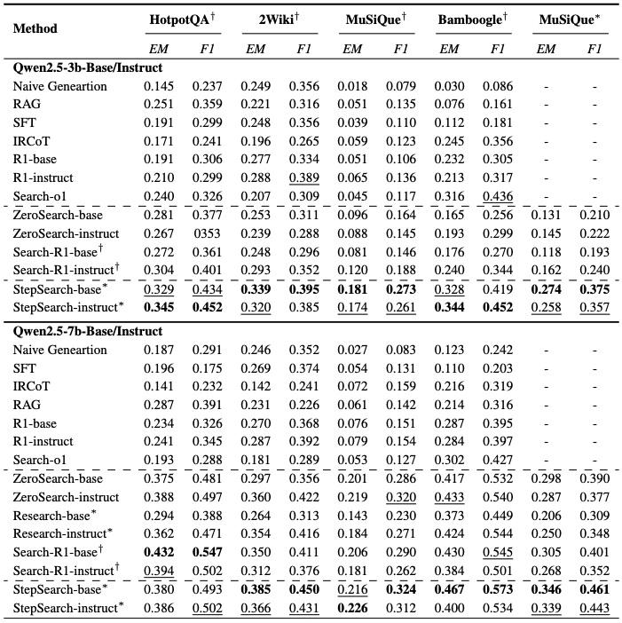
</div>

###  Different RL Comparison 

<div align="center">
    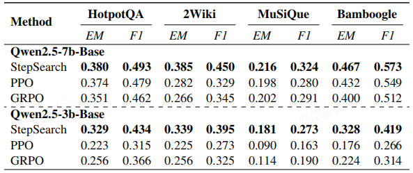
</div>
<div align="center">
    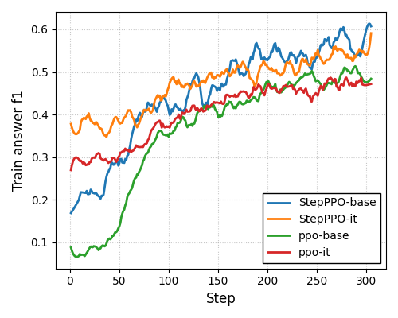
    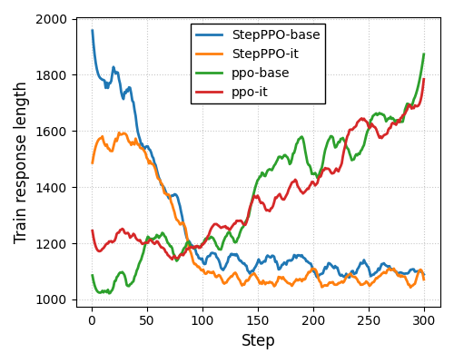
</div>

###  Ablation Study

<div align="center">
    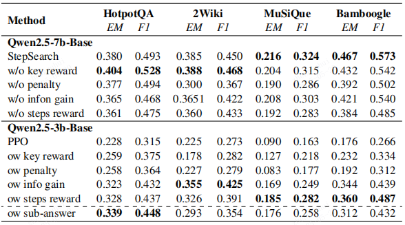
</div>
<div align="center">
    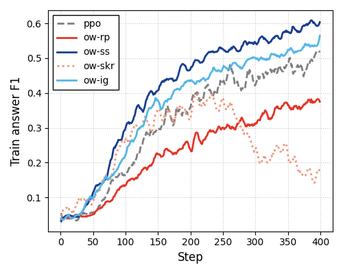
    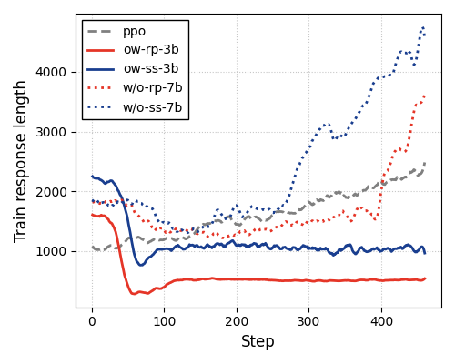
    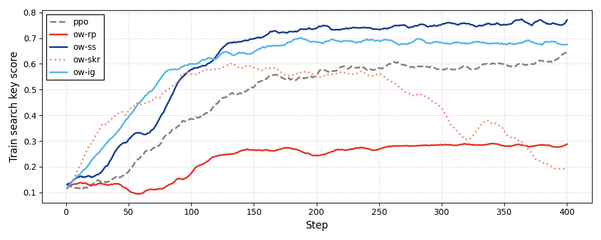
</div>

###  Case Study

<div align="center">
    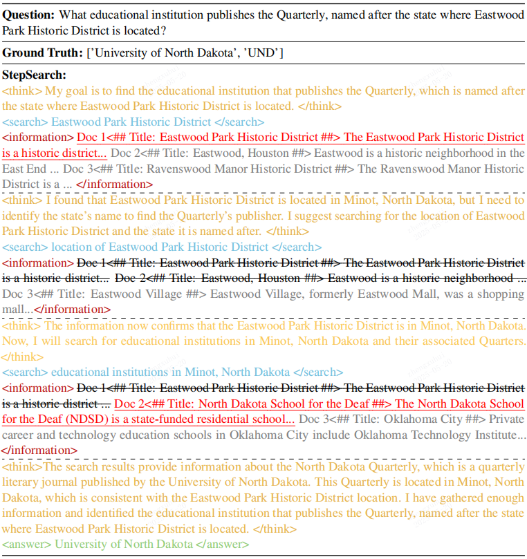
    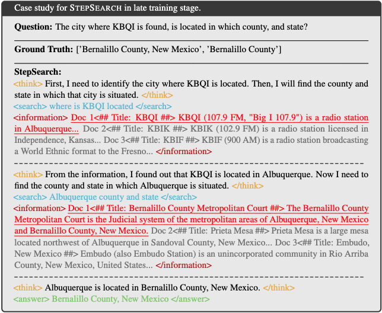
    
    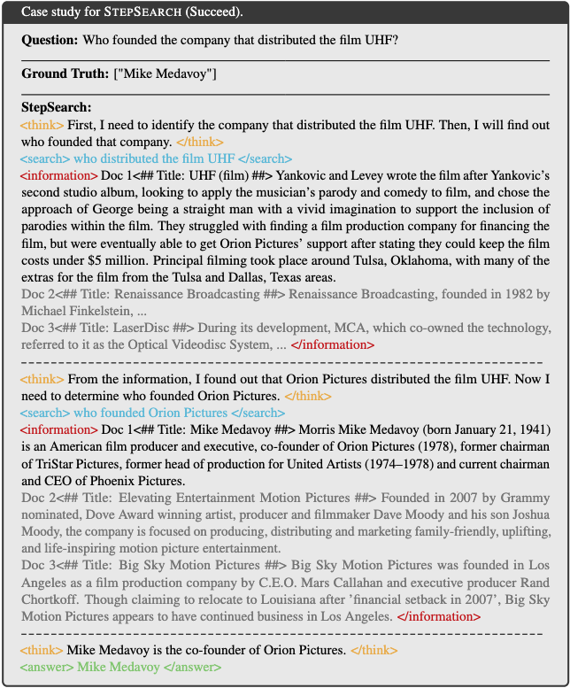
    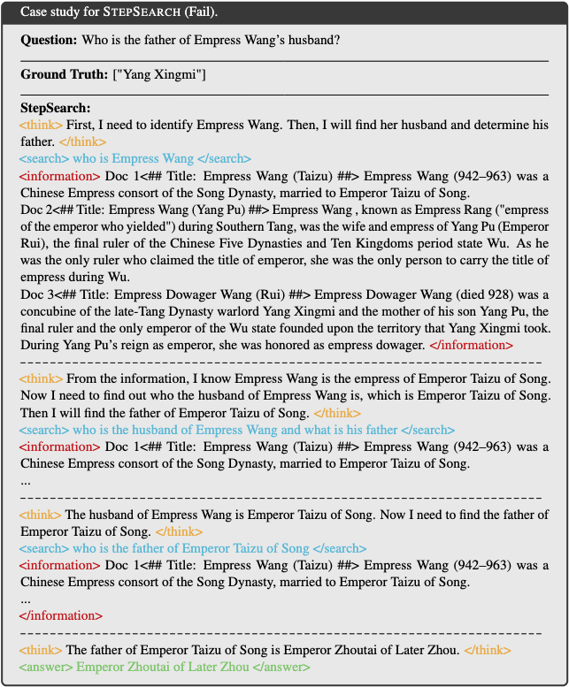


</div>


# 🙏Acknowledgements

This work is implemented based on [Search-R1](https://github.com/PeterGriffinJin/Search-R1), [veRL](https://github.com/volcengine/verl), and [RAGEN](https://github.com/ZihanWang314/RAGEN/tree/main). We sincerely thank the authors of these projects for their valuable contributions to the open-source community.


# 🚩Citation

If this work is helpful, please kindly cite as:

```bigquery
@misc{wang2025stepsearchignitingllmssearch,
      title={StepSearch: Igniting LLMs Search Ability via Step-Wise Proximal Policy Optimization}, 
      author={Ziliang Wang and Xuhui Zheng and Kang An and Cijun Ouyang and Jialu Cai and Yuhang Wang and Yichao Wu},
      year={2025},
      eprint={2505.15107},
      archivePrefix={arXiv},
      primaryClass={cs.CL},
      url={https://arxiv.org/abs/2505.15107}, 
}
```
